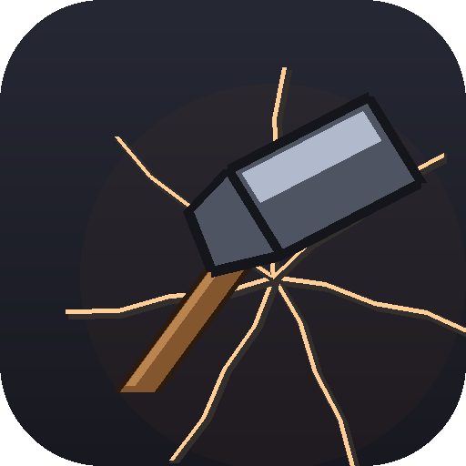
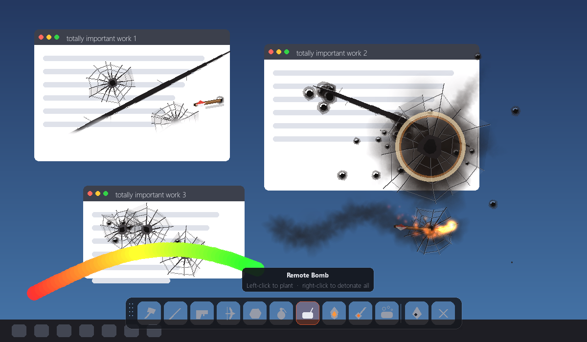

# Desktop Destroyer by Rom



**[desktopdestroyer.web.app](https://desktopdestroyer.web.app)** — download it, or try a
playable demo right in your browser.

Takes a screenshot of your desktop, puts it back on screen in a borderless
always-on-top window, and lets you destroy it. Smash it with a hammer, unload a
shotgun into it, burn it with a flamethrower, paint over it — then wash it clean
and start again. Nothing on your actual machine is touched; you're wrecking a
photograph.



## Play it — nothing to install

Grab **`Desktop Destroyer by Rom.exe`** and double-click it. That's the whole
thing: one 32 MB file, no Python, no installer, no dependencies, no admin
rights. Copy it to a USB stick, email it, drop it on someone's desktop — it runs
anywhere on 64-bit Windows.

Press **Esc** to quit at any time.

> First launch takes a couple of seconds longer than later ones: a one-file
> build unpacks itself into a temp folder before starting. That's the price of
> everything being in a single file.

Nothing is written to the machine and your real desktop is never touched — you
are wrecking a photograph of it.

## Run from source instead

Needs Python 3.10+.

```bash
pip install -r requirements.txt
python main.py
```

There are no binary assets to download. Every sound is synthesised at startup
from noise and sine bursts (see "Sounds" below).

## Build the executable

```bash
pip install pyinstaller
python build.py
```

This draws `assets/icon.ico` from code (the hammer — the tool the app opens
with) and produces `dist/Desktop Destroyer by Rom.exe`. Use
`python build.py --icon-only` to redraw just the icon; it's vector-drawn in
`build.py`, so edit it there rather than in an image editor.

## Controls

| Input | Action |
|---|---|
| Left mouse | Use the current tool (hold and drag for flame / paint / wash) |
| Right mouse | Secondary action — detonates every planted remote bomb |
| `1` – `9`, `0` | Pick a tool |
| Mouse wheel | Cycle tools |
| `R` or `Backspace` | Squeegee the whole desktop clean |
| `Space` | Save a PNG of the wreckage to `Pictures\Desktop Destroyer` |
| `Esc` or `Q` | Quit |
| Drag the grip | Move the toolbar out of your way |

## Tools

| Tool | What it does |
|---|---|
| 🔨 **Hammer** | Shattered-glass crater, flying debris, screen shake |
| ⚔️ **Katana** | Drag out a stroke, release to cut. Leaves a tapered gash that bites deepest mid-stroke; a quick click becomes a flick cut |
| 🔫 **Shotgun** | A cone of bullet holes, muzzle flash, sparks, recoil |
| 🏹 **Bow** | Hold to draw, release to loose. The arrow stays stuck in your screen — a full draw shatters the surface around it. Set it on fire and it chars and topples out |
| 🪨 **Rock** | Lob a stone. No fuse, no charge — it lands, it cracks, throw another |
| 💣 **Grenade** | Arcs in, sits blinking for 1.2s, then craters everything nearby |
| 🧨 **Remote Bomb** | Left-click to plant charges anywhere, right-click to set them **all** off in a staggered chain. Fire reaching a charge sets it off on its own — no remote needed |
| ⛽ **Gasoline** | Pour a slick, then light it with the flamethrower or any blast. Fire races along the trail like a fuse, burns for 10–20s, and leaves a charred scar |
| 🔥 **Flamethrower** | Continuous flame while held; burns build to black char, and ignites gasoline and arrows |
| ☢️ **Nuke Strike** | Lock up to 10 targets, right-click to launch. Each missile craters ~a fifth of the screen and sets off any gasoline or bombs in the blast |
| 🎨 **Paintbrush** | Rainbow stroke whose hue shifts as you drag |
| 🧼 **Washer** | Scrubs the original desktop back into view; also douses gasoline and fire |

## Command line

```bash
python main.py                    # fullscreen, live capture
python main.py --windowed         # 1280x760 window — use this while developing
python main.py --image shot.png   # destroy a still image instead
python main.py --monitor 2        # capture a different display
python main.py --no-audio         # silence
python main.py --selftest         # headless smoke test, exits 0/1
```

`--windowed` is strongly recommended while hacking on the code: a borderless
fullscreen always-on-top window is annoying to escape if you introduce a bug in
the event loop.

## How it works

The renderer keeps two full-screen surfaces:

- **`pristine`** — the original capture. Never modified. The washer restores from it.
- **`world`** — a mutable copy that every tool draws its damage into.

Damage goes straight into `world` rather than onto a separate transparent
overlay. That keeps the per-frame cost at a single opaque blit no matter how
wrecked the screen gets, instead of compositing an ever-heavier alpha layer.
Particles are transient and redrawn on top each frame; the toolbar is drawn last
and deliberately excluded from screen shake so it stays readable and clickable.

```
destroyer/
  app.py          window, layers, input routing, render loop
  capture.py      screen grab, DPI awareness, always-on-top
  decals.py       permanent damage: cracks, holes, char, cuts, craters, paint
  explosion.py    the shared blast — used by grenade, bomb, gasoline and nuke
  fire.py         gasoline, fire, and the flammable things it spreads to
  particles.py    sparks / flame / smoke / debris / droplets
  audio.py        procedural sound bank with on-disk override
  toolbar.py      floating draggable UI
  config.py       tunable constants
  tools/          one file per tool
build.py          draws the icon and packages the one-file .exe
```

### Adding a tool

Subclass `Tool`, implement the hooks you need, and add it to the list in
`tools/__init__.py`. The toolbar button, number-key shortcut, cursor and input
routing all come for free — number keys are assigned from list order, so they
can never drift out of sync with the toolbar.

```python
class Chainsaw(Tool):
    id, label, hint, key = "saw", "Chainsaw", "Hold to cut", pygame.K_6

    def press(self, ctx, pos):
        ctx.audio.play("hammer")
        ctx.shake(0.4)

    def hold(self, ctx, pos, prev, dt):
        for point in iter_segment(prev, pos, 6.0):
            decals.scorch(ctx.world, point, 18, ctx.rng, strength=60)

    def draw_icon(self, surf, rect, tint):
        pygame.draw.rect(surf, tint, rect.inflate(-20, -30))
```

`ctx` gives a tool everything it may touch: `world`, `pristine`, `particles`,
`audio`, `rng`, `shake()`, `size` and `fire`.

A tool that needs to render something transient in world space — a projectile
in flight, say — implements `draw_overlay(surf, offset)`. It runs after the
particles with the same shake offset, which keeps in-flight objects out of
`world` until they actually land. The bow, rock, grenade, remote bomb and nuke
all use it; so does the katana, for the flash along a fresh cut.

`alt_press(ctx, pos)` handles a right-click — the remote bomb's detonator and
the nuke's launch button both use it.

**Cross-tool state lives in `ctx.fire`.** Some things outlive the tool that made
them and must react to a *different* tool's fire: a poured gasoline slick, an
arrow stuck in the screen, a planted bomb charge. A tool is deactivated the
instant you switch away, so none of that can live inside a tool — it lives in the
`FireSystem`, which the App ticks and draws every frame. That single owner is
what makes gasoline catch from the flamethrower, arrows char and topple, and a
blast set off the bombs around it (which set off the bombs around *them*). If you
add a tool that starts a fire or drops something flammable, go through `ctx.fire`
rather than baking it into `world`.

### Sounds

There are no `.wav` files in the repo. On startup each sound is generated with
numpy — the shotgun is a noise burst split into a lowpassed body and a
highpassed crack over a sine thump, the flamethrower is a seamlessly looped
band of filtered noise, and so on.

To use your own audio instead, drop a file into `assets/sounds/` named after the
sound. Anything present on disk wins over the synthesised version. This works
for the built `.exe` too — make an `assets/sounds/` folder *next to the
executable* and it will pick the files up without a rebuild:

```
assets/sounds/  hammer.wav   slash.wav    gunshot.wav  bow.wav    thunk.wav
                rock.wav     toss.wav     explode.wav  flame.wav  ignite.wav
                paint.wav    wash.wav     clean.wav    click.wav
```

`flame.wav` and `wash.wav` are played on a loop, so they should be seamless.

## Tests

```bash
python main.py --selftest       # drives every tool headlessly
python tests/test_input.py      # toolbar, hotkeys, drag routing, restore
python tests/test_fire.py       # the cross-tool gasoline / fire / bomb chemistry
```

All run under SDL's dummy video driver, so they need no display and are safe in
CI.

## Notes and gotchas

- The screenshot is taken **before** the window is created, otherwise the app
  photographs itself.
- `capture.make_dpi_aware()` runs before anything else. Without it, Windows
  reports a scaled resolution on high-DPI displays and the capture ends up a
  different size than the window — a blurry, offset desktop that breaks the
  illusion.
- On multi-monitor setups only the chosen display is covered; the others stay
  live, which is handy for keeping an editor open while you test.
- The built `.exe` has no console, so an unexpected error would vanish silently.
  If one ever happens, the app writes `Desktop Destroyer crash.log` next to the
  executable and shows a dialog pointing at it.
- Windows SmartScreen may warn on first run because the `.exe` isn't code-signed
  — "More info" → "Run anyway". Signing it needs a paid certificate.
